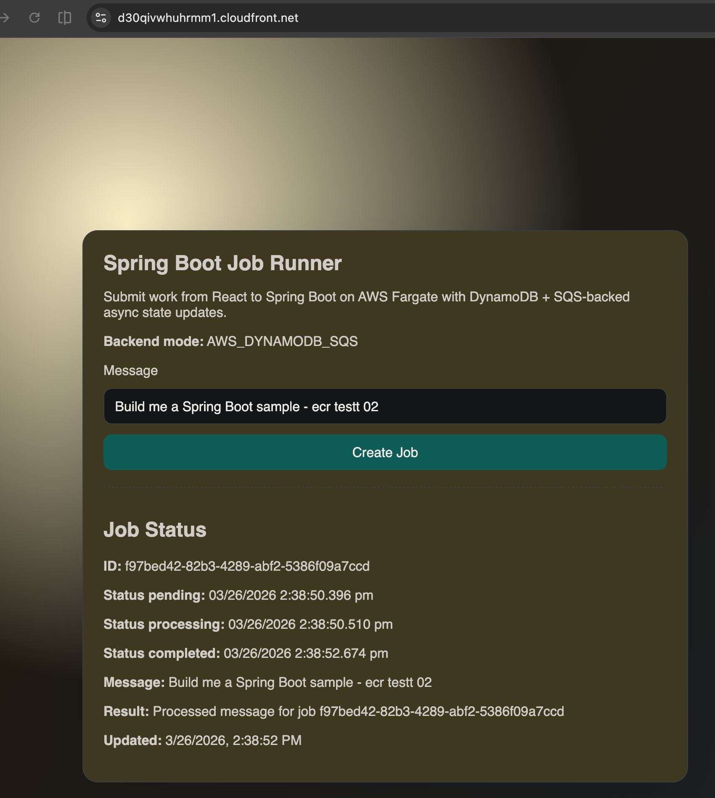

# AWS Fargate + DynamoDB + SQS Fullstack Starter

React UI + Spring Boot backend designed for an AWS-first deployment model.

## Live Service

| | URL |
|---|---|
| **App** | https://{frontend-cloudfront-domain} |
| **API** | https://{api-cloudfront-domain} |

## Screenshots

Main UI:



## What this project does

- React UI submits jobs and polls status updates.
- Spring Boot API supports two runtime modes:
	- `LOCAL_MEMORY`: in-memory jobs for local development.
	- `AWS_DYNAMODB_SQS`: writes jobs to DynamoDB and enqueues processing via SQS.
- In AWS mode, queued jobs are processed asynchronously and transition:
	1. `PENDING`
	2. `PROCESSING`
	3. `COMPLETED`

## Running

Backend image build/push runs in AWS CodeBuild — local Docker is not required.

```bash
./artifacts/aws/deploy.sh <stack-name> <region> <account-id> <vpc-id> <subnet-a> <subnet-b>
./artifacts/aws/deploy-frontend.sh <frontend-stack-name> <region> <bucket-name> <api-url> frontend
```

## Architecture / Topology

```
Browser ──HTTPS──► CloudFront (CDN) ──► S3 (Vite dist)
                        │
                        └──HTTPS──► ALB ──► ECS Fargate: Spring Boot (:8080)
                                                │                │
                                                ▼                ▼
                                           DynamoDB         SQS Queue
                                          (jobs table)     (job msgs)
                               ▲──────── CloudFormation (IaC) ──────────▲
```

```
┌─────────────────────────────────────────────────────────────────────────┐
│                              AWS Account                                │
│                                                                         │
│   ECR                                                                   │
│   ┌──────────────────┐                                                  │
│   │  backend image   │◄── CodeBuild (build + push from S3 source zip)  │
│   └──────────────────┘                                                  │
│           │ image pull                  CloudFormation (IaC)           │
│           ▼                             manages all resources below     │
│   ┌─────────────────────────────────────────────────────────────┐       │
│   │                   VPC (public subnets)                      │       │
│   │                                                             │       │
│   │   ALB ──► ECS Fargate task                                  │       │
│   │   ┌──────────────────────────────────────────────────┐      │       │
│   │   │ Spring Boot (:8080)                              │      │       │
│   │   │ • POST /jobs  → DynamoDB write + SQS enqueue     │      │       │
│   │   │ • GET  /jobs/{id} → DynamoDB read                │      │       │
│   │   │ • worker: SQS poll → PROCESSING → COMPLETED      │      │       │
│   │   └────────────────────┬───────────────┬─────────────┘      │       │
│   └────────────────────────┼───────────────┼────────────────────┘       │
│                            │               │                             │
│                 ┌──────────▼───────┐  ┌────▼─────────┐                 │
│                 │   DynamoDB       │  │  SQS Queue   │                 │
│                 │  (jobs table)    │  │  (job msgs)  │                 │
│                 │  PENDING         │  └──────────────┘                 │
│                 │  PROCESSING      │                                    │
│                 │  COMPLETED       │                                    │
│                 └──────────────────┘                                    │
│                                                                         │
│   CloudFront + S3 (frontend)                                           │
│   ┌────────────────────────────────────────────────────┐               │
│   │ CloudFront (HTTPS) ──► S3 bucket (Vite dist)       │               │
│   └────────────────────────────────────────────────────┘               │
└─────────────────────────────────────────────────────────────────────────┘

Deploy flow
───────────
local machine
  └─ artifacts/aws/deploy.sh
       ├─ upload source zip → S3
       ├─ trigger CodeBuild → build + push image → ECR
       └─ deploy infra.yaml (CloudFormation)
            ├─ VPC / subnets / security groups
            ├─ DynamoDB table
            ├─ SQS queue + dead-letter queue
            ├─ ECS cluster + Fargate task + ALB
            └─ IAM roles + CloudWatch logs

  └─ artifacts/aws/deploy-frontend.sh
       ├─ deploy frontend-infra.yaml (CloudFormation)
       │    ├─ S3 bucket (static hosting)
       │    └─ CloudFront distribution
       ├─ build React app (VITE_API_BASE_URL → ApiHttpsUrl)
       ├─ upload dist/ → S3
       └─ invalidate CloudFront cache
```

## API

- `POST /jobs` -> accepts `{ "message": "..." }`, returns `202` with `{ jobId, status }`
- `GET /jobs/{jobId}` -> returns current job state
- `GET /jobs/mode` -> returns backend mode (`LOCAL_MEMORY` or `AWS_DYNAMODB_SQS`)

## Project structure

- `frontend`: React + TypeScript + Vite
- `backend`: Spring Boot API, queue worker loop, DynamoDB/SQS integration
- `artifacts/aws`: deploy artifacts for ECS Fargate + DynamoDB + SQS

## AWS mode configuration

Set these environment variables for the backend container/task:

- `AWS_JOBS_ENABLED=true`
- `AWS_JOBS_TABLE_NAME=<dynamodb-table-name>`
- `AWS_JOBS_QUEUE_URL=<sqs-queue-url>`
- `AWS_JOBS_QUEUE_POLLING_ENABLED=true`

When `AWS_JOBS_ENABLED=true`, create/read operations use DynamoDB and async processing uses SQS.

## AWS artifacts included

- `backend/Dockerfile`: container image build for ECS/Fargate
- `artifacts/aws/infra.yaml`: CloudFormation stack for DynamoDB, SQS, ECS, ALB, IAM, logs
- `artifacts/aws/task-definition.json`: task definition template
- `artifacts/aws/frontend-infra.yaml`: CloudFormation stack for S3 + CloudFront frontend hosting
- `artifacts/aws/deploy.sh`: backend deploy helper (builds image in AWS CodeBuild, then deploys API stack)
- `artifacts/aws/deploy-frontend.sh`: helper script to deploy frontend infra and static assets

## Deploy backend (ECS Fargate + ALB)

```bash
chmod +x artifacts/aws/deploy.sh
./artifacts/aws/deploy.sh <stack-name> <region> <account-id> <vpc-id> <subnet-a> <subnet-b>
```

The backend deploy script uses AWS CodeBuild for image build/push, so local Docker is not required.

This outputs both API URLs:

- `ApiBaseUrl`: ALB HTTP URL (`http://...elb.amazonaws.com`)
- `ApiHttpsUrl`: CloudFront HTTPS URL (`https://...cloudfront.net`)

Use `ApiHttpsUrl` for browser-based frontend deployments to avoid mixed-content blocking.

## AWS deployment gotchas

- Run deploy commands from repo root so relative paths like `artifacts/aws/infra.yaml` resolve correctly.
- If frontend is on HTTPS and API is HTTP, the browser blocks requests (`Failed to fetch`) because of mixed content.
- Use stack output `ApiHttpsUrl` as `VITE_API_BASE_URL` when deploying frontend.
- First-time ECS service stabilization can take 15-30 minutes while tasks register with ALB and old targets drain.
- Expected job transition (`PROCESSING` -> `COMPLETED`) is a few seconds after warm-up; if it drifts much higher, redeploy latest backend image and verify scheduler concurrency settings.
- `CREATE_IN_PROGRESS` on CloudFormation can continue even when ECS already shows `runningCount=desiredCount`.
- If ECS events show `CannotPullContainerError ... image ...:latest not found`, your image was not pushed to ECR yet.

Quick checks:

```bash
aws cloudformation describe-stacks --stack-name <stack-name> --region <region> --query "Stacks[0].StackStatus" --output text
aws ecs describe-services --cluster <ecs-cluster-name> --services <service-name> --region <region> --query "services[0].[runningCount,desiredCount,deployments[0].rolloutState]" --output text
```

When image is missing in ECR:

1. Re-run CodeBuild image build and wait for `SUCCEEDED`.
2. Force ECS service to redeploy:

```bash
aws ecs update-service --cluster <ecs-cluster-name> --service <service-name> --force-new-deployment --region <region>
```

Rate limit note:

- If CodeBuild fails with Docker Hub `429 Too Many Requests`, use AWS Public ECR mirror base images in `backend/Dockerfile` (already configured in this repo).

## First-time backend deploy checklist

Use this checklist for the first deployment in a new AWS account/region.

1. Confirm AWS auth and region.
2. Create/select a VPC and two public subnets in different AZs.
3. Ensure Internet Gateway and route table allow `0.0.0.0/0` egress.
4. Ensure both subnets have auto-assign public IP enabled.
5. Create S3 bucket for source zip uploads.
6. Create ECR repo `aws-springboot-jobs`.
7. Create IAM role for CodeBuild and attach permissions for S3/ECR/Logs.
8. Upload source zip (includes `buildspec.yml` and backend source).
9. Run CodeBuild and wait for image push success.
10. Deploy CloudFormation backend stack from `artifacts/aws/infra.yaml`.
11. If ECS service is stuck, check target health and ECS service events.
12. Retrieve `ApiBaseUrl` from stack outputs and run smoke test.

Helpful commands:

```bash
aws cloudformation describe-stacks --stack-name <backend-stack-name> --region <region> --query "Stacks[0].Outputs[?OutputKey=='ApiBaseUrl'].OutputValue" --output text
aws cloudformation describe-stacks --stack-name <backend-stack-name> --region <region> --query "Stacks[0].Outputs[?OutputKey=='ApiHttpsUrl'].OutputValue" --output text
npm run smoke:aws -- <api-base-url> <frontend-url>
```

## Deploy frontend (S3 + CloudFront)

```bash
chmod +x artifacts/aws/deploy-frontend.sh
./artifacts/aws/deploy-frontend.sh \
	<frontend-stack-name> \
	<region> \
	<globally-unique-site-bucket-name> \
	<api-base-url-from-backend-stack> \
	frontend
```

The frontend script will:

- Deploy/update S3 + CloudFront infrastructure.
- Build the React app with `VITE_API_BASE_URL` set to your backend ALB URL.
- Upload `frontend/dist` to S3.
- Invalidate CloudFront cache.

Use the `FrontendUrl` stack output as your public UI URL.

## Smoke tests

AWS hosted check (API + CloudFront frontend):

```bash
npm run smoke:aws -- <api-base-url> <frontend-url>
```

Example:

```bash
npm run smoke:aws -- http://my-api-alb.amazonaws.com https://d123456abcdef.cloudfront.net
```
